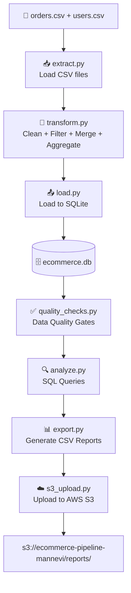

# 🛒 E-Commerce Data Pipeline | Python · Pandas · SQLite · SQL · Airflow · AWS S3

---

## 📖 Project Overview

An end-to-end batch ETL pipeline that ingests raw e-commerce order and user data from CSV files,
cleans and merges it using Pandas, stores it in a structured SQLite database,
runs SQL-powered business analytics, and delivers timestamped CSV reports uploaded to AWS S3.

Built with production-grade practices — modular design, structured logging, error handling,
data quality checks, and Apache Airflow orchestration.

---

## 🎯 Business Objective

**Problem:**
E-commerce teams need a reliable way to track customer revenue,
identify top buyers, and monitor sales performance across regions —
without manually processing raw order files every day.

**Solution:**
This pipeline automatically ingests, cleans, joins, and analyzes
order and user data to answer key business questions:
- Who are the top customers by total spend?
- Which country generates the most revenue?
- What does the daily revenue trend look like?
- Which customers are high value vs low value?

---

## 🛠️ Tech Stack

| Tool | Usage in This Project |
|------|-----------------------|
| Python 3 | Core pipeline logic |
| Pandas | Data cleaning, merging, and aggregation |
| SQLite (sqlite3) | Local database to store structured data |
| SQL | Business analytics — CTEs, window functions, CASE WHEN |
| Apache Airflow | Pipeline orchestration and scheduling |
| AWS S3 (boto3) | Cloud storage for output reports |
| python-dotenv | Secure config and credentials management |
| Git & GitHub | Version control and portfolio hosting |

---

## 🏗️ Pipeline Flow



---

## 📁 Project Structure

```
ecommerce_pipeline/
├── data/
│   ├── orders.csv
│   ├── users.csv
│   └── ecommerce.db          ← generated at runtime (gitignored)
├── scripts/
│   ├── __init__.py
│   ├── config.py             ← central config management
│   ├── logger.py             ← structured logging
│   ├── extract.py            ← load CSV files
│   ├── transform.py          ← clean, filter, merge, aggregate
│   ├── load.py               ← load to SQLite
│   ├── analyze.py            ← SQL business queries
│   ├── quality_checks.py     ← data quality gates
│   ├── export.py             ← export CSV reports
│   ├── s3_upload.py          ← upload reports to AWS S3
│   └── pipeline.py           ← master orchestrator
├── dags/
│   └── ecommerce_pipeline_dag.py  ← Airflow DAG
├── screenshots/              ← Airflow UI and S3 screenshots
├── output/                   ← local timestamped CSV reports
├── logs/                     ← pipeline run logs (gitignored)
├── .env                      ← AWS credentials (gitignored)
├── .gitignore
├── requirements.txt
└── README.md
```

---

## 🌐 Data Source

**Type:** Synthetic CSV dataset simulating e-commerce transactions

| File | Columns |
|------|---------|
| `orders.csv` | order_id, user_id, amount, order_date |
| `users.csv` | user_id, name, country |

---

## 🔄 ETL Process

### Extract
- Loads orders.csv and users.csv into Pandas DataFrames
- Validates row counts on load
- Raises FileNotFoundError with clear log message if files are missing

### Transform
- Fills missing order amounts with median value
- Converts order_date from text to datetime
- Removes duplicate rows
- Standardizes name and country formatting
- Filters out invalid orders (zero or negative amounts)
- Merges orders and users on user_id — LEFT JOIN
- Aggregates revenue by user, country, and date

### Load
- Loads all DataFrames into SQLite — fact_orders and dim_users tables
- Truncate and reload pattern — fresh data on every run
- Verifies row counts after every load

### Quality Checks
Automated data quality gates run after every load — pipeline stops if any check fails:
- Null check — no nulls in critical columns
- Row count check — minimum expected rows loaded
- Duplicate check — no duplicate order IDs
- Range check — all amounts greater than zero
- Schema check — all expected columns present

### Export + S3 Upload
- Exports 4 timestamped CSV reports to local output/ folder
- Automatically uploads all reports to AWS S3 bucket

---

## ☁️ AWS S3 Output

Reports are uploaded to:
```
s3://ecommerce-pipeline-mannevi/reports/
```

| Report | Contents |
|--------|----------|
| `top_customers_*.csv` | Customer ranked by total revenue |
| `revenue_by_country_*.csv` | Revenue, order count, avg order by country |
| `daily_revenue_*.csv` | Revenue trend by date |
| `customer_segments_*.csv` | High / Mid / Low value classification |

---

## 🌀 Airflow Orchestration

Pipeline is orchestrated as an Airflow DAG with 5 tasks running in sequence:

```
extract → transform → load → quality_checks → export
```

- Operator: PythonOperator
- Schedule: @daily
- Full pipeline completes in under 1 minute (12 seconds on clean run)
- Retry: 1 retry with 5 minute delay

Screenshots of the Airflow UI are in the `screenshots/` folder.

---

## 🔐 Production Engineering Practices

| Practice | Implementation |
|----------|---------------|
| Structured logging | Timestamps, severity levels, module names in every log line |
| Error handling | try/except/finally wrapping every critical step |
| Config management | All paths and settings in config.py — no hardcoding |
| Data quality gates | 5 automated checks after every load |
| Audit trail | Timestamped CSV backup on every pipeline run |
| Secure credentials | AWS keys stored in .env — never pushed to GitHub |

---

## ▶️ How to Run

**1. Clone the repository**
```bash
git clone https://github.com/mannevi/ecommerce-etl-pipeline.git
cd ecommerce-etl-pipeline
```

**2. Create and activate virtual environment**
```bash
python -m venv venv
venv\Scripts\activate        # Windows
source venv/bin/activate     # Mac/Linux
```

**3. Install dependencies**
```bash
pip install -r requirements.txt
```

**4. Add your AWS credentials to `.env`**
```
AWS_ACCESS_KEY_ID=your_key
AWS_SECRET_ACCESS_KEY=your_secret
AWS_BUCKET_NAME=your_bucket_name
AWS_REGION=us-east-2
```

**5. Run the full pipeline**
```bash
python -m scripts.pipeline
```

**Or run step by step**
```bash
python -m scripts.extract         # Load CSV data
python -m scripts.transform       # Clean and merge
python -m scripts.load            # Load into SQLite
python -m scripts.quality_checks  # Run quality gates
python -m scripts.analyze         # Run SQL queries
python -m scripts.export          # Export CSV reports
python -m scripts.s3_upload       # Upload to AWS S3
```

---

## 📊 Sample Output

### Merged dataset (fact_orders)

| order_id | user_id | amount | order_date | name | country |
|----------|---------|--------|------------|------|---------|
| 1 | 101 | 250 | 2024-01-01 | John | USA |
| 2 | 102 | 100 | 2024-01-02 | Alice | India |
| 3 | 101 | 300 | 2024-01-03 | John | USA |
| 4 | 103 | 225 | 2024-01-04 | Bob | USA |
| 5 | 104 | 200 | 2024-01-05 | Eva | UK |

### Top customers report

| name | total_revenue |
|------|--------------|
| John | 550 |
| Bob | 225 |
| Eva | 200 |
| Alice | 100 |

### Revenue by country report

| country | total_revenue | total_orders | avg_order_value |
|---------|--------------|--------------|-----------------|
| USA | 975 | 3 | 258.3 |
| UK | 200 | 1 | 200.0 |
| India | 100 | 1 | 100.0 |

---

## 👩‍💻 Author

**Manne Vaishnavi**

MS in Computer Science

GitHub: https://github.com/mannevi
