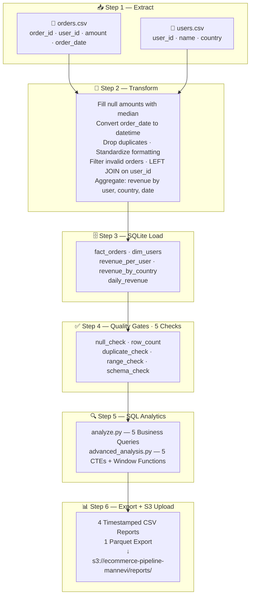
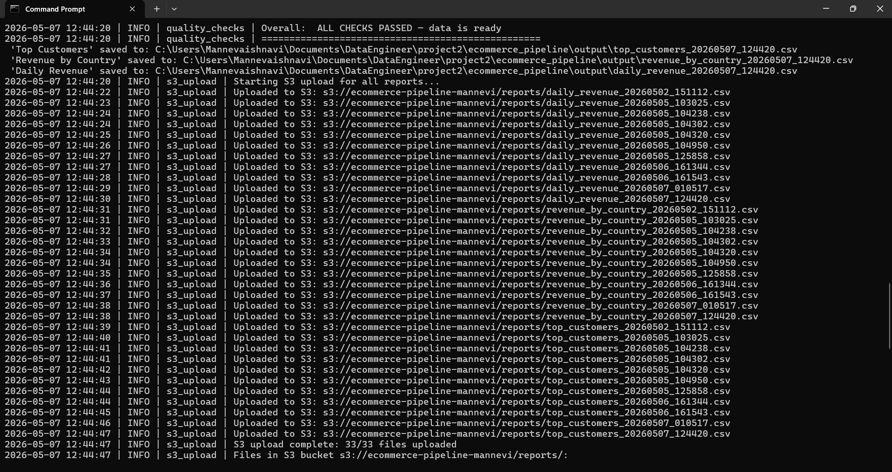
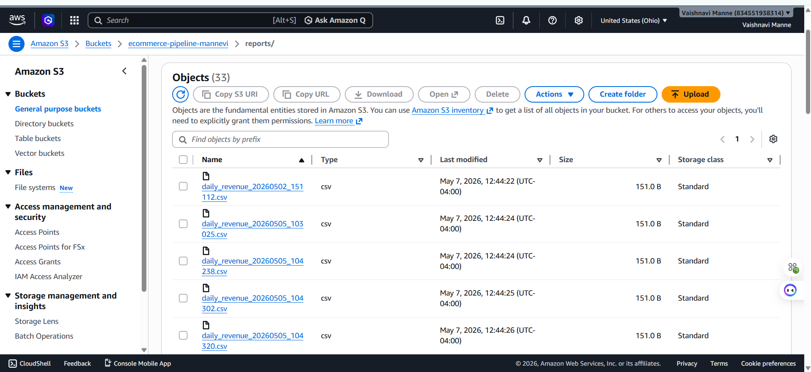
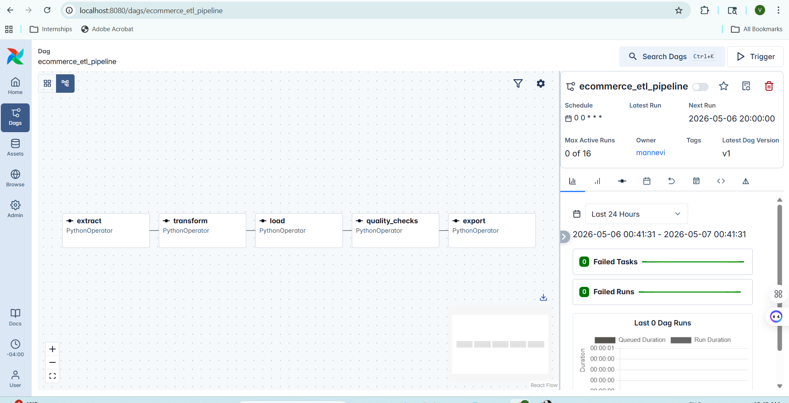
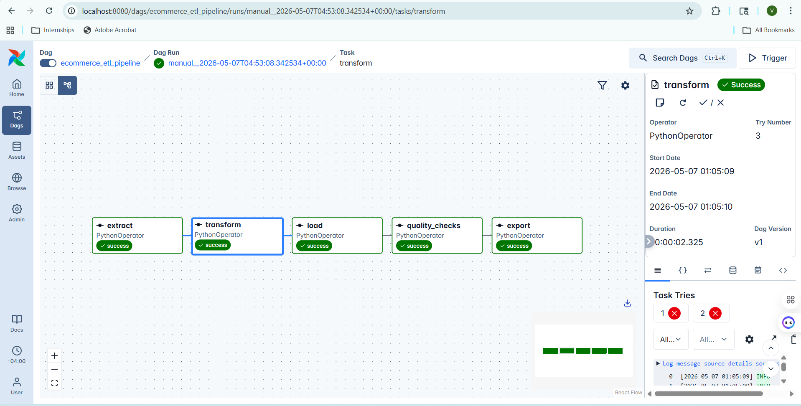

# 🛒 E-Commerce ETL Pipeline

> End-to-end batch ETL pipeline — from raw CSV orders to structured SQLite analytics,
> timestamped reports, and automated AWS S3 delivery.


---

## 📋 Project Overview

A **production-styled batch ETL pipeline** that ingests raw e-commerce order and user data,
cleans and merges it with pandas, stores it in a structured SQLite database,
runs SQL-powered business analytics, and delivers timestamped reports to AWS S3.

| | |
|---|---|
| 📦 **Input** | `orders.csv` + `users.csv` — synthetic e-commerce transactions |
| 🔧 **Database** | SQLite — 5 structured tables loaded on every run |
| 📊 **Analytics** | 10 SQL queries — 5 standard + 5 advanced (CTEs + window functions) |
| 📁 **Reports** | 4 timestamped CSV reports + Parquet export |
| ☁️ **Storage** | AWS S3 — `s3://ecommerce-pipeline-mannevi/reports/` — 33 files uploaded |
| 🎛️ **Orchestrated** | Apache Airflow — 5-task DAG running `@daily` |

> Built with production-grade engineering practices — modular design, structured logging,
> error handling, data quality gates, and automated cloud delivery.

---

## 🎯 Business Objective

### Problem
E-commerce teams need a reliable way to track customer revenue,
identify top buyers, and monitor sales performance across regions —
without manually processing raw order files every day.

### Solution
This pipeline automatically ingests, cleans, joins, and analyzes order and user
data to answer four key business questions:

| # | Business Question | Answered By |
|---|-------------------|-------------|
| 💰 | Who are the top customers by total spend? | `analyze.py` — Query 1 |
| 🌍 | Which country generates the most revenue? | `analyze.py` — Query 2 |
| 📈 | What does the daily revenue trend look like? | `analyze.py` — Query 3 |
| 🏷️ | Which customers are High / Mid / Low value? | `analyze.py` — Query 5 |

---

## 🛠️ Tech Stack

| Tool | Version | Role in This Project |
|------|---------|----------------------|
| **Python** | 3.14 | Core pipeline language |
| **pandas** | 2.2.3 | Data cleaning, merging, and aggregation |
| **SQLite** | Built-in | Local database — 5 structured tables |
| **SQL** | — | Business analytics — CTEs, window functions, CASE WHEN |
| **Apache Airflow** | — | Orchestrates 5-task DAG end-to-end (`@daily`) |
| **AWS S3 (boto3)** | 1.43.5 | Cloud storage — timestamped reports delivery |
| **pyarrow** | — | Columnar Parquet export for processed data |
| **python-dotenv** | 1.2.2 | Secure credentials management via `.env` |

---

## 🏗️ Pipeline Architecture



> 🎛️ **Orchestrated by Apache Airflow** — 5-task DAG running `@daily`
> ⏱️ **Full pipeline completes in ~12 seconds on clean run**

---

## 📁 Project Structure

```
ecommerce-etl-pipeline/
│
├── data/
│   ├── orders.csv                    ← raw order transactions
│   ├── users.csv                     ← raw user data
│   └── ecommerce.db                  ← generated at runtime (gitignored)
│
├── scripts/
│   ├── config.py                     ← central config — all paths and thresholds
│   ├── logger.py                     ← structured logging across all scripts
│   ├── extract.py                    ← load CSV files into DataFrames
│   ├── transform.py                  ← clean, filter, merge, aggregate
│   ├── load.py                       ← load 5 tables into SQLite
│   ├── quality_checks.py             ← 5 automated data quality gates
│   ├── analyze.py                    ← 5 SQL business queries
│   ├── advanced_analysis.py          ← 5 advanced SQL — CTEs + window functions
│   ├── export.py                     ← timestamped CSV + Parquet reports
│   ├── s3_upload.py                  ← upload all reports to AWS S3
│   └── pipeline.py                   ← master orchestrator — runs full pipeline
│
├── dags/
│   └── ecommerce_pipeline_dag.py     ← Airflow 5-task DAG (@daily)
│
├── screenshots/                      ← pipeline run evidence
├── output/                           ← local timestamped reports (gitignored)
├── logs/                             ← pipeline run logs (gitignored)
├── .env                              ← AWS credentials (gitignored)
├── requirements.txt
└── README.md
```

---

## 🌐 Data Source

**Type:** Synthetic CSV dataset simulating e-commerce transactions

| File | Columns | Description |
|------|---------|-------------|
| `orders.csv` | `order_id`, `user_id`, `amount`, `order_date` | Raw order transactions |
| `users.csv` | `user_id`, `name`, `country` | Customer master data |

> Data is intentionally simple — the focus of this project is the
> **engineering pipeline**, not the data volume.

---

## 🔄 Pipeline Steps

### Step 1 — Extract
- Loads `orders.csv` and `users.csv` into pandas DataFrames
- Validates row counts on load
- Raises `FileNotFoundError` with clear log message if files are missing

### Step 2 — Transform
- Fills missing order amounts with **median value**
- Converts `order_date` from text to datetime
- Removes duplicate rows
- Standardizes `name` and `country` formatting (`.str.strip().str.title()`)
- Filters invalid orders — `amount > 0`, `user_id` not null, `date >= 2024-01-01`
- Merges orders and users on `user_id` — **LEFT JOIN**
- Aggregates revenue by user, country, and date

### Step 3 — SQLite Load
Loads all DataFrames into SQLite — truncate and reload on every run:

| Table | Contents |
|-------|----------|
| `fact_orders` | Full merged orders with user info |
| `dim_users` | Clean user dimension table |
| `revenue_per_user` | Total revenue aggregated by customer |
| `revenue_by_country` | Total revenue aggregated by country |
| `daily_revenue` | Revenue trend by date |

### Step 4 — Data Quality Gates
Five automated checks — pipeline halts if any gate fails:

| Gate | Check |
|------|-------|
| `null_check` | No nulls in critical columns |
| `row_count` | Minimum expected rows loaded |
| `duplicate_check` | No duplicate order IDs |
| `range_check` | All amounts greater than zero |
| `schema_check` | All expected columns present |



### Step 5 — SQL Analytics

**Standard queries** (`analyze.py`):
- Top customers by total spend
- Revenue by country — total, order count, avg order value
- Daily revenue trend
- Revenue share % per customer
- Customer spend classification — High / Mid / Low Value

**Advanced queries** (`advanced_analysis.py`):
- CTE — High value customers only (`total_revenue > 200`)
- CTE — Multi-step customer segmentation
- Window — `ROW_NUMBER()` top spender per country
- Window — `SUM() OVER` running total revenue by date
- Window — Each order's % share of country revenue

### Step 6 — Export + S3 Upload
- Exports 4 timestamped CSV reports to local `output/` folder
- Exports merged orders as **Parquet** (columnar format)
- Automatically uploads all reports to `s3://ecommerce-pipeline-mannevi/reports/`
- **33 files confirmed uploaded** across multiple pipeline runs



---

## 🎛️ Airflow Orchestration

5-task DAG runs `@daily` — all tasks use `PythonOperator`:

```
extract → transform → load → quality_checks → export_and_upload
```

- Retry logic — 1 retry with 5-minute delay on failure
- `catchup=False` — no backfill on restart
- All 5 tasks confirmed green ✅




---

## ☁️ AWS S3 Output

Reports uploaded to `s3://ecommerce-pipeline-mannevi/reports/` — region `us-east-2`:

| Report | Contents |
|--------|----------|
| `top_customers_*.csv` | Customers ranked by total revenue |
| `revenue_by_country_*.csv` | Revenue, order count, avg order by country |
| `daily_revenue_*.csv` | Revenue trend by date |
| `customer_segments_*.csv` | High / Mid / Low value classification |
| `orders_merged_*.parquet` | Full merged orders in columnar format |

> Reports are timestamped on every run — full audit trail maintained automatically.

---

## ▶️ How to Run

**1. Clone the repository**
```bash
git clone https://github.com/mannevi/ecommerce-etl-pipeline.git
cd ecommerce-etl-pipeline
```

**2. Create virtual environment**
```bash
python -m venv venv
venv\Scripts\activate        # Windows
source venv/bin/activate     # Mac/Linux
pip install -r requirements.txt
```

**3. Add AWS credentials to `.env`**
```
AWS_ACCESS_KEY_ID=your_key
AWS_SECRET_ACCESS_KEY=your_secret
AWS_BUCKET_NAME=your_bucket_name
AWS_REGION=us-east-2
```

**4. Run the full pipeline**
```bash
python -m scripts.pipeline
```

**Or run step by step**
```bash
python -m scripts.extract
python -m scripts.transform
python -m scripts.load
python -m scripts.quality_checks
python -m scripts.analyze
python -m scripts.advanced_analysis
python -m scripts.export
python -m scripts.s3_upload
```

---

## 📊 Sample Output

### Top Customers
| name | total_revenue |
|------|--------------|
| John | 550 |
| Bob | 225 |
| Eva | 200 |
| Alice | 100 |

### Revenue by Country
| country | total_revenue | total_orders | avg_order_value |
|---------|--------------|--------------|-----------------|
| USA | 775 | 3 | 258.3 |
| UK | 200 | 1 | 200.0 |
| India | 100 | 1 | 100.0 |

### Customer Segments
| name | total_revenue | segment |
|------|--------------|---------|
| John | 550 | High Value |
| Bob | 225 | Mid Value |
| Eva | 200 | Mid Value |
| Alice | 100 | Low Value |

> Segment thresholds defined in `config.py` — `HIGH_VALUE ≥ 500`, `MID_VALUE ≥ 200`

---

## 🧠 What I Built & Learned

| Challenge | How I Solved It |
|-----------|-----------------|
| Modular pipeline design | Each step is an independent script — easy to test, debug, and extend |
| Null handling in raw data | Detected missing amounts, filled with median — no data loss |
| LEFT JOIN data integrity | Logged unmatched orders explicitly — no silent data drops |
| Pipeline halts on bad data | Quality gates run before export — pipeline stops automatically on failure |
| Audit trail for every run | Timestamped CSV + Parquet on every run — full history preserved in S3 |
| Credentials security | AWS keys in `.env` — gitignored, never hardcoded |

---

## 🚀 Future Improvements

- [ ] Expand to larger real-world e-commerce dataset
- [ ] Add **incremental loading** — process only new orders on each run
- [ ] Add **GitHub Actions CI/CD** — auto-run quality checks on every push

---

## 👩‍💻 Author

**Manne Vaishnavi**
MS in Computer Science

[](https://github.com/mannevi)
[](https://www.linkedin.com/in/vaishnavimanne/)

---

*Built with synthetic e-commerce data — focused on pipeline engineering, not data volume.*
