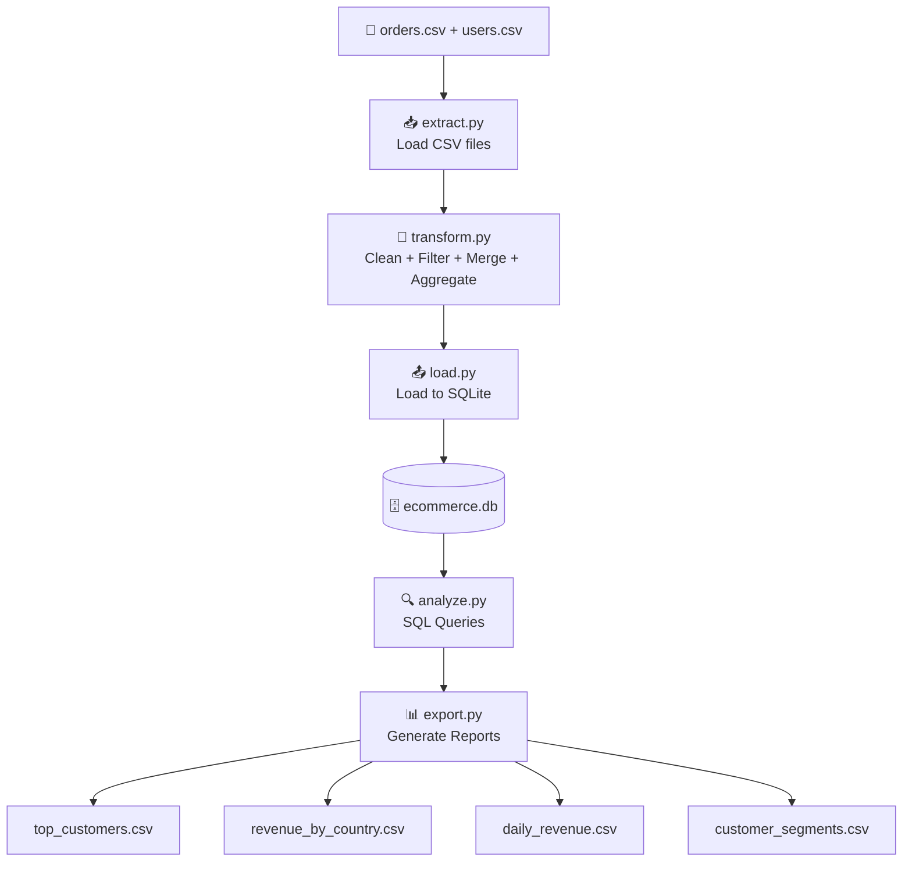

# 🛒 E-Commerce Data Pipeline | Python · Pandas · SQLite · SQL
 
---
 
## 📖 Project Overview
 
An end-to-end data pipeline that ingests raw e-commerce order and user data from CSV files,
cleans and merges it using Pandas, stores it in a structured SQLite database,
and delivers SQL-powered business reports as CSV outputs.
 
Designed to simulate a real-world e-commerce data pipeline
from raw source data to business-ready insights.
 
---
 
## 🎯 Business Objective
 
**Problem:**
E-commerce teams need a reliable way to track customer revenue,
identify top buyers, and monitor sales performance across regions —
without manually processing raw order files every day.
 
**Solution:**
This pipeline automatically ingests, cleans, joins, and analyzes
order and user data to answer key business questions like:
- Who are the top customers by total spend?
- Which country generates the most revenue?
- What does the daily revenue trend look like?
- Which customers are high value vs low value?
---
 
## 🛠️ Tech Stack
 
| Tool | Usage in This Project |
|------|-----------------------|
| Python 3 | Core pipeline logic |
| Pandas | Data cleaning, merging, and aggregation |
| SQLite (sqlite3) | Local database to store structured data |
| SQL | Business analytics queries |
| CSV | Input data source and report output |
| Git & GitHub | Version control and portfolio hosting |
 
> 💡 Built with Pandas for real-world data engineering workflows —
> replacing manual Python loops with scalable,modular and structured pipeline design inspired by production workflows
---
 
## 🏗️ Pipeline Flow
 

 
---
 
## 📁 Project Structure
 
```
ecommerce_pipeline/
├── data/
│   ├── orders.csv
│   ├── users.csv
│   └── ecommerce.db
├── scripts/
│   ├── __init__.py
│   ├── extract.py
│   ├── transform.py
│   ├── load.py
│   ├── analyze.py
│   ├── export.py
│   └── pipeline.py
├── output/
├── .gitignore
├── requirements.txt
└── README.md
```
 
| File | Purpose |
|------|---------|
| `scripts/extract.py` | Load orders and users CSV files |
| `scripts/transform.py` | Clean, filter, merge, and aggregate data |
| `scripts/load.py` | Load all tables into SQLite database |
| `scripts/analyze.py` | Run SQL business queries |
| `scripts/export.py` | Export query results as CSV reports |
| `scripts/pipeline.py` | Master file — runs full pipeline end to end |
| `data/ecommerce.db` | SQLite database (gitignored) |
| `output/` | Final timestamped CSV reports |

 Note: ecommerce.db is generated when the pipeline runs and is ignored by Git.
---
 
## 🌐 Data Source
 
**Type:** Synthetic CSV dataset simulating e-commerce orders and users
**orders.csv:** order_id, user_id, amount, order_date
**users.csv:** user_id, name, country
 
---
 
## 🔄 ETL Process
 
### Extract
- Loads orders.csv and users.csv into Pandas DataFrames
- Confirms row counts on load
### Transform
- Fills missing order amounts with median value
- Converts order_date from text to datetime type
- Removes duplicate rows
- Standardizes name and country formatting
- Filters out invalid orders (zero or negative amounts)
- Merges orders and users on user_id (LEFT JOIN)
- Aggregates revenue by user, country, and date
### Load
- Loads all DataFrames into SQLite as structured tables
- Creates fact_orders and dim_users (basic data model)
- Implements a simple dimensional model with `fact_orders` and `dim_users`
- Replaces tables on every run — truncate and reload pattern
- Verifies row counts after load
---
 
## ▶️ How to Run
 
**1. Clone the repository**
```bash
git clone https://github.com/mannevi/ecommerce-etl-pipeline.git
cd ecommerce-etl-pipeline
```
 
**2. Create and activate virtual environment**
```bash
python -m venv venv
venv\Scripts\activate        # Windows
source venv/bin/activate     # Mac/Linux
```
 
**3. Install dependencies**
```bash
pip install -r requirements.txt
```
 
**4. Run the full pipeline**
```bash
python -m scripts.pipeline
```
 
**Or run step by step**
```bash
python -m scripts.extract    # Load CSV data
python -m scripts.transform  # Clean and merge
python -m scripts.load       # Load into SQLite
python -m scripts.analyze    # Run SQL queries
python -m scripts.export     # Export CSV reports
```
 
---
 
## 📊 Sample Output
 
### Merged dataset (fact_orders)
 
| order_id | user_id | amount | order_date | name | country |
|----------|---------|--------|------------|------|---------|
| 1 | 101 | 250 | 2024-01-01 | John | USA |
| 2 | 102 | 100 | 2024-01-02 | Alice | India |
| 3 | 101 | 300 | 2024-01-03 | John | USA |
| 4 | 103 | 225 | 2024-01-04 | Bob | USA |
| 5 | 104 | 200 | 2024-01-05 | Eva | UK |
 
### Top customers report
 
| name | total_revenue |
|------|--------------|
| John | 550 |
| Bob | 225 |
| Eva | 200 |
| Alice | 100 |
 
### Revenue by country report
 
| country | total_revenue | total_orders | avg_order_value |
|---------|--------------|--------------|-----------------|
| USA | 975 | 3 | 258.3 |
| UK | 200 | 1 | 200.0 |
| India | 100 | 1 | 100.0 |
 
### Customer segments report
 
| name | total_revenue | customer_segment |
|------|--------------|-----------------|
| John | 550 | High Value |
| Bob | 225 | Mid Value |
| Eva | 200 | Mid Value |
| Alice | 100 | Low Value |
 
---
 
## 👩‍💻 Author
 
**Manne Vaishnavi**
 
MS in Computer Science
 
GitHub: https://github.com/mannevi
